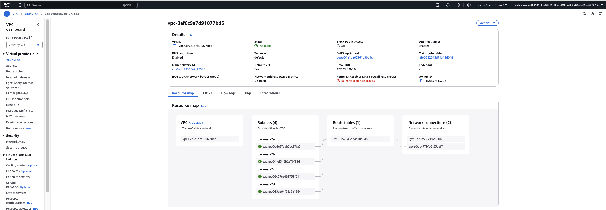

# Project: STEDI Human Balance Analytics - Data Lake and Spark on AWS


**Note:** This project is part of [Data Engineering with AWS nanodegree program](https://www.udacity.com/course/data-engineer-nanodegree--nd027).


## 1. Project Description
The **STEDI Human Balance Analytics** solution aims to help users to do a _STEDI balance exercise_. The STEDI Team has been hard at work developing a hardware **STEDI Step Trainer** that:
* trains the user to do a STEDI balance exercise;
* and has sensors on the device that collect data to train a machine-learning algorithm to detect steps;
* has a companion mobile app that collects customer data and interacts with the device sensors.

The **Step Trainer** is just a _motion sensor_ that records the _distance of the object detected_. The app uses a mobile phone _accelerometer_ to detect motion in the X, Y, and Z directions.

The STEDI team wants to use the motion sensor data to train a machine learning model to detect steps accurately in real-time. Some of the early adopters have agreed to _share their data for research purposes_, so that **privacy** will be a **primary consideration** in deciding _what data can be used._ **Only these customers’ Step Trainer and accelerometer data should be used in the training data for the machine learning model.**

### 🎯 Goal
Develop a _data engineering solution_ that _extracts_ the data produced by the STEDI Step Trainer sensors and the mobile app, and **curate** them into a **data **lakehouse** solution on AWS** so that Data Scientists can train the machine learning model.

## 2. Project Structure
```
Udacity_Aws_Spark_N_DataLake
.
├── images
│   ├── 01_Customer_Landing_Data.jpg
│   ├── 02_Accelerometer_Landing_Data.jpg
│   ├── 03_step_trainer_landing_Data.jpg
│   ├── 04_Customer_Landing_Filtered_Data.jpg
│   ├── 05_customer_trusted_data.jpg
│   ├── 06_accelerometer_trusted_data.jpg
│   ├── 07_step_trainer_trusted_data.jpg
│   ├── 08_machine_learning_curated.jpg
│   ├── Consolidated_Data_From_All_3_Zones_All_Tables.png
│   ├── Endpoints.png
│   ├── Expected_Results.png
│   ├── Glue_Job_01_Customer-Landing-to-trusted-zone.jpg
│   ├── Glue_Job_02_Accelerometer_LANDING_to_TRUSTED.jpg
│   ├── Glue_Job_03_Step-Trainer-Landing_to_Trusted.jpg
│   ├── Glue_job_04_ Customer_Trusted_to_Curated.jpg
│   ├── Glue_Job_05_Machine_Learning_Curated.jpg
│   ├── Internet_gateway.png
│   ├── Landing_Zone_Data.png
│   ├── READme.md
│   ├── Route_table.png
│   └── VPC.png
├── Project_README.md
├── Spark-jobs
│   ├── Accelerometer_Landing_to_Trusted.py
│   ├── Customer_Trusted_to_Curated.py
│   ├── Customer-Landing-to-trusted.py
│   ├── Machine_Learning_Curated.py
│   └── Step-Trainer-Landing_to_Trusted.py
└── SQL
    ├── 01_Customer_Landing.sql
    ├── 02_accelerometer_landing.sql
    ├── 03_step_trainer_landing.sql
    └── README.md
```

## 3. Project data
STEDI has three _JSON data sources_ to use from the **Step Trainer**. These are the data of Landing Zone which is the raw initial data for the whole project.

**1. Customer Records (from fulfillment and the STEDI website):**
- [Customer Records Download URL](https://github.com/udacity/nd027-Data-Engineering-Data-Lakes-AWS-Exercises/tree/main/project/starter/customer)

- A total of _956 rows_ in a _single_ JSON file 
- Fields:
    - `customerName` string
    - `email` string
    - `phone` string
    - `birthDay` string
    - `serialNumber` string
    - `registrationDate` bigint
    - `lastUpdateDate` bigint
    - `shareWithResearchAsOfDate` bigint
    - `shareWithPublicAsOfDate` bigint

**2. Accelerometer Records (from the mobile app)**
- [Accelerometer Records Download URL](https://github.com/udacity/nd027-Data-Engineering-Data-Lakes-AWS-Exercises/tree/main/project/starter/accelerometer)
- A total of _81,273 rows_ across _ten_ JSON files 
- Fields:
    - `user` string
    - `timeStamp` bigint
    - `x` float
    - `y` float
    - `z` float

**3. Step Trainer Records (data from the motion sensor)**
- [Data Download URL](https://github.com/udacity/nd027-Data-Engineering-Data-Lakes-AWS-Exercises/tree/main/project/starter/step_trainer)
- A total of _28680 rows_ across _eight_ JSON files 
- Fields:
    - `sensorReadingTime` bigint
    - `serialNumber` string
    - `distanceFromObject` int

```
tablename				record_count
-------------------------------------
customer_landing		956
accelerometer_landing	81273
step_trainer_landing	28680
```

## 4. Proposed Data Engineering Solution
My solution consists of building a **data lakehouse** for the STEDI data. This **data lakehouse** consists of _three different data categories which can be further categories as Landing, Trusted and Curated:
- **Customer Data**: 
- **Landing**: raw ingested data
- **trusted**: data from the _landing zone_ after some filtering, cleaning, and/or augmenting
- **curated**: data from the _trusted zone_ after the addition of some business-level aggregates.

Here is the entire data storing structure 

```
.
├── accelerometer
│   ├── landing
│   └── trusted
├── customer
│   ├── curated
│   ├── landing
│   └── trusted
├── Machine_Learning
│   └── ML_Curated
└── step_trainer
    ├── landing
    └── trusted
```


I developed several Spark Jobs using AWS Glue to perform ETL operations on the data and build the lakehouse architecture.

The following sections provide an overview of the solution, highlighting key configurations, Spark Jobs, and sample SQL queries. Some parts are presented in a step-by-step manner to support learning and clarity.

### 4.1. Upload Raw Data to a S3 bucket
Let's upload the _project data_ (JSON files) from the original github repository to a **S3 bucket**. This **ingested data** will correspond to our ***landing zone*** respect to 3 categories Customer, accelerometer and Step trainer.

On AWS, I opened the **CloudShell terminal (AWS CLI)** and executed the steps below:
```
# create a S3 bucket for storing the data
aws s3 mb s3://biswa-aws-spark-datalake --recursive

# download the github repo with the project data
git clone https://github.com/udacity/nd027-Data-Engineering-Data-Lakes-AWS-Exercises.git

# copy `customer` landing data to s3 bucket under "customer/landing" folder
cd nd027-Data-Engineering-Data-Lakes-AWS-Exercises/project/starter/

aws s3 cp customer s3://biswa-aws-spark-datalake/customer/landing/

# copy `accelerometer` data landing data to s3 bucket under "accelerometer/landing" folder

aws s3 cp accelerometer s3://biswa-aws-spark-datalake/accelerometer/landing/

# copy `step trainer` data landing data to s3 bucket under "step_trainer/landing" folder

aws s3 cp step_trainer s3://biswa-aws-spark-datalake/step_trainer/landing/
```

**outout of above mentioned operations:**

  - E.g., `landing/` in `aws s3 cp customer s3://biswa-aws-spark-datalake/customer/landing/`

```
step_trainerstarter $ aws s3 mb s3://biswa-aws-spark-datalake/
make_bucket: biswa-aws-spark-datalake
starter $ cd ..
project $ ls
readme_images  README.md  starter
project $ cd starter/
starter $ pwd
/home/cloudshell-user/nd027-Data-Engineering-Data-Lakes-AWS-Exercises/project/starter
starter $ ls
accelerometer  customer  README.md  step_trainer
starter $ aws s3 cp customer/ s3://biswa-aws-spark-datalake/customer/ --recursive
upload: customer/landing/customer-1691348231425.json to s3://biswa-aws-spark-datalake/customer/landing/customer-1691348231425.json
starter $ aws s3 cp accelerometer/ s3://biswa-aws-spark-datalake/accelerometer/ --recursive
upload: accelerometer/landing/accelerometer-1691348231495.json to s3://biswa-aws-spark-datalake/accelerometer/landing/accelerometer-1691348231495.json
upload: accelerometer/landing/accelerometer-1691348231724.json to s3://biswa-aws-spark-datalake/accelerometer/landing/accelerometer-1691348231724.json
upload: accelerometer/landing/accelerometer-1691348231445.json to s3://biswa-aws-spark-datalake/accelerometer/landing/accelerometer-1691348231445.json
upload: accelerometer/landing/accelerometer-1691348231576.json to s3://biswa-aws-spark-datalake/accelerometer/landing/accelerometer-1691348231576.json
upload: accelerometer/landing/accelerometer-1691348231881.json to s3://biswa-aws-spark-datalake/accelerometer/landing/accelerometer-1691348231881.json
upload: accelerometer/landing/accelerometer-1691348232031.json to s3://biswa-aws-spark-datalake/accelerometer/landing/accelerometer-1691348232031.json
upload: accelerometer/landing/accelerometer-1691348231931.json to s3://biswa-aws-spark-datalake/accelerometer/landing/accelerometer-1691348231931.json
upload: accelerometer/landing/accelerometer-1691348231810.json to s3://biswa-aws-spark-datalake/accelerometer/landing/accelerometer-1691348231810.json
upload: accelerometer/landing/accelerometer-1691348231983.json to s3://biswa-aws-spark-datalake/accelerometer/landing/accelerometer-1691348231983.json
starter $ aws s3 cp step_trainer/ s3://biswa-aws-spark-datalake/step_trainer/ --recursive
upload: step_trainer/landing/step_trainer-1691348232132.json to s3://biswa-aws-spark-datalake/step_trainer/landing/step_trainer-1691348232132.json
upload: step_trainer/landing/step_trainer-1691348232085.json to s3://biswa-aws-spark-datalake/step_trainer/landing/step_trainer-1691348232085.json
upload: step_trainer/landing/step_trainer-1691348232038.json to s3://biswa-aws-spark-datalake/step_trainer/landing/step_trainer-1691348232038.json
starter $ 
```


### 4.2. Configure the S3 Gateway Endpoint
By default, Glue Jobs cannot access networks outside your Virtual Private Cloud (VPC). Since the S3 service operates on a different network, you need to create an S3 Gateway Endpoint. This endpoint enables secure, private connectivity between your Glue Jobs and your S3 buckets, ensuring data traffic remains within the AWS network.

To successfully run Spark Jobs using AWS Glue, the following resources and configurations are required:

####Step 1. Find your VPC ID and Routing Table ID.
	
	On AWS CLI execute below commands 
	~ $ aws ec2 describe-vpcs |grep VpcId
            "VpcId": "vpc-0ef6c9a7d91077bd3",
            
    ~ $ aws ec2 describe-route-tables | grep RouteTableId
                    "RouteTableId": "rtb-0752043d74a18d048",
            "RouteTableId": "rtb-0752043d74a18d048",

####Step 2. Create a S3 Gateway Endpoint
	
	On AWS CLI execute below command
		~ $ aws ec2 create-vpc-endpoint --vpc-id vpc-0ef6c9a7d91077bd3 --service-name com.amazonaws.us-east-1.s3 --route-table-ids rtb-0752043d74a18d048
           
####Step 3. Check the created S3 Gateway Endpoint	
	--> Go to the VPC Dashboard on AWS.
	--> Be sure you selected the same region where you created the endpoint
	--> Click on Endpoints
	--> See the created S3 Gateway Endpoint
	
####Step 4. Create a Glue Service IAM Role to manage Glue
#####Create an IAM Role with access to AWS Glue	
	aws iam create-role --role-name GlueServiceS3Role-CustomETLSparkAWS --assume-role-policy-document '{
	    "Version": "2012-10-17",
	    "Statement": [
	        {
	            "Effect": "Allow",
	            "Principal": {
	                "Service": "glue.amazonaws.com"
	            },
	            "Action": "sts:AssumeRole"
	        }
	    ]
	}'	
	
	~ $ aws iam get-role --role-name GlueServiceS3Role-CustomETLSparkAWS --output json
	{
	    "Role": {
	        "Path": "/",
	        "RoleName": "GlueServiceS3Role-CustomETLSparkAWS",
	        "RoleId": "AROASJUXMEHZKNM3GUAR2",
	        "Arn": "arn:aws:iam::158157513202:role/GlueServiceS3Role-CustomETLSparkAWS",
	        "CreateDate": "2025-04-15T21:39:28+00:00",
	        "AssumeRolePolicyDocument": {
	            "Version": "2012-10-17",
	            "Statement": [
	                {
	                    "Effect": "Allow",
	                    "Principal": {
	                        "Service": "glue.amazonaws.com"
	                    },
	                    "Action": "sts:AssumeRole"
	                }
	            ]
	        },
	        "Description": "Allows Glue to call AWS services on your behalf. ",
	        "MaxSessionDuration": 3600,
	        "RoleLastUsed": {
	            "LastUsedDate": "2025-04-16T21:50:42+00:00",
	            "Region": "us-west-2"
	        }
	    }
	}
		~ $ aws iam list-attached-role-policies --role-name GlueServiceS3Role-CustomETLSparkAWS --output json
	{
	    "AttachedPolicies": [
	        {
	            "PolicyName": "AWSGlueServiceRole",
	            "PolicyArn": "arn:aws:iam::aws:policy/service-role/AWSGlueServiceRole"
	        },
	        {
	            "PolicyName": "AWSGlueConsoleFullAccess",
	            "PolicyArn": "arn:aws:iam::aws:policy/AWSGlueConsoleFullAccess"
	        },
	        {
	            "PolicyName": "AmazonS3FullAccess",
	            "PolicyArn": "arn:aws:iam::aws:policy/AmazonS3FullAccess"
	        }
	    ]
	}
	~ $ 
Inspect the created role on IAM dashboard


####Step 5. Inspect the permissions/policies of this role on IAM dashboard
Inspect the permissions/policies of this role on IAM dashboard

####validations of the above operations

#####**Internet gateway**
 <br/>

#####**Endpoints**
 <br/>

#####**VPC**
 <br/>

#####**Route Table**
 <br/>


### 4.3. Inspect Landing Zone Data by Glue Studio and AWS Athena
We can leverage AWS services to create and manage a **database** that interacts directly with data stored in an _S3 bucket_. Using AWS **Glue Studio**, we can _organize and manage_ databases and tables based on this **S3** data. Additionally, **Amazon Athena** enables us to run SQL queries directly on the data.

#### Create a Database for our project data
Step 1: Create a Database for Project Data

	1.	Navigate to the AWS Glue Dashboard
	2.	Go to Data Catalog (in the side menu) > Databases
	3.	Click Add Database
	4.	Enter the Database name: steadi
	5.	Click Create Database

Although it’s possible to create tables directly from the **Glue Dashboard (Data Catalog)**, I have used will use **AWS Athena* to define our tables through SQL statements for more control and flexibility.


#### Set up a _query result location_ for Athena in Amazon S3
On **AWS Athena Dashboard**
- Click on `Edit settings`
- **Location of query result:** `s3://biswa-aws-spark-datalake/athena/`
    - the _ending trailing slash_ is important to indicate that `athena` is a folder

#### Create a _table_ for the `Customer` Landing data
**NB:** I will only provide a step-by-step for this table creation.

On **AWS Athena Dashboard**, Go to ***Query editor (side menu)***:
- **Database:** `steadi`
- Click on `Create` > Create a table from data source > S3 bucket data
    - **table name:** customer_landing
    - **Choose an existing database:** `steadi`
    - **Data store:** S3
    - **Location of input data set:** `s3://biswa-aws-spark-datalake/customer/landing/`
    - **Table type:** Apache Hive
    - **Format:** JSON
    - On column details, or add each column _manually_ or you **bulk the column names**
    - **Bulk add columns**    
	
          customerName string,
			email string, 
			phone string, 
			birthDay string, 
			serialNumber string, 
			registrationDate bigint, 
			lastUpdateDate bigint, 
			shareWithResearchAsOfDate bigint, 
			shareWithPublicAsOfDate bigint
    
See `SQL/01_Customer_Landing.sql` for the resulting SQL.


#### Create a _table_ for the `Accelerometer` Landing data
- **table name:**: `accelerometer_landing`
- **Location of input data set:**: `s3://biswa-aws-spark-datalake/accelerometer/landing/`
- **Bulk add columns**

	
          user string,
			timeStamp bigint, 
			x float, 
			y float, 
			z float

See `sql/02_accelerometer_landing.sql` for the resulting SQL.


#### Create a _table_ for the `Step Trainer` Landing data
- **table name:**: `step_trainer_landing`
- **Location of input data set:**: `s3://biswa-aws-spark-datalake/step_trainer/landing/`
- **Bulk add columns**
- 	
          sensorReadingTime bigint,
			serialNumber string, 
			distanceFromObject int

See `SQL/03_step_trainer_landing.sql` for the resulting SQL.

#### Inspect Data from the Landing Zone
On _AWS Athena_, I performed a _full table scan_ in the three tables:

**Customer Landing Data**:
- `SELECT * FROM customer_landing`
  - 956 rows
  - Note there is a single JSON file for this data on `s3://biswa-aws-spark-datalake/customer/landing/`

 <br/>


**Accelerometer Landing Data**
- `SELECT * FROM accelerometer_landing;`
  - 81273 rows
  - Note there are 10 json files in `s3://biswa-aws-spark-datalake/accelerometer/landing/` which are equally formatted
  - During table creation, **Athena** scans and ingests the data from **ALL** files in the specified bucket

 <br/>

**Step Trainer Landing Data**
- `SELECT * FROM step_trainer_landing;`
  - 28680 rows
  - Note there are 8 json files in `s3://biswa-aws-spark-datalake/step_trainer/landing/` which are equally formatted

 <br/>

**Customer, Accelerometer, Step Trainer Landing Data together**
 <br/>

### 4.4. Spark Job to transform Customer LANDING to TRUSTED data
I used **Glue Studio** to create _ETL jobs_ that _extracts_, _transforms_, and _loads_ our data from S3. I used its _Visual ETL_ tool to visually create this job. I saved the corresponding _PySpark_ codes in the [`./Spark-jobs` folder](./Spark-jobs).

- Sanitize the Customer data from the Website (Landing Zone) and _only store_ the Customer Records who **agreed to share their data for research purposes (Trusted Zone)**.
- The field `sharewithresearchasofdate` is a _timestamp_ (unixtime in ms) that indicates when the user accepted to share his/her data.
- _Empty_ or `0` indicate the user did not consent.
- To convert an unixtime _timestamp_ to a readable format, we can use: `FROM_UNIXTIME(sharewithresearchasofdate / 1000e0)`
  - E.g.: `1655296571764` --> `2022-06-15 12:36:11.764`

 <br/>

 <br/>

**Notes:**
- The resulting data was saved in the S3 bucket: `s3://biswa-aws-spark-datalake/customer/trusted/`
- The trusted data has `482` records
 - An alternative is to perform the following query _directly_ from the _landing data_
  - `SELECT * FROM customer_landing WHERE sharewithresearchasofdate != 0;`
- **PySpark script:** [`./Spark-jobs/customer_landing_to_trusted.py`](./Spark-jobs/Customer-Landing-to-trusted.py)


**FULL TABLE SCAN**
 <br/>


### 4.5. Spark Job to transform Accelerometer LANDING to TRUSTED data
- Accelerometer readings only from Customers **who have consented** to share their data for research.
- I also filtered out any _accelerometer readings_ that **were prior to the research consent date** in order to ensure consent was in place at the time that data was gathered.
 
 <br/>

**Notes:**
- The resulting data was saved in the S3 bucket: `s3://biswa-aws-spark-datalake/accelerometer/trusted/`
- The trusted data has `40981` records
- **PySpark script:** [`./Spark-jobs/Accelerometer_Landing_to_Trusted.py`](./Spark-jobs/Accelerometer_Landing_to_Trusted.py)


### 4.6. Spark Job to transform Customer TRUSTED to CURATED data
- _Sanitize_ the **Customer data (Trusted Zone)** that _only_ includes customers _who have accelerometer data_ and _have agreed to share their data for research_ called **customers_curated**.


 <br/>

**Notes:**
- The resulting data was saved in the S3 bucket: `s3://biswa-aws-spark-datalake/customer/curated/`


- The curated data has `482` records
- **PySpark script:** [`./Spark-jobs/Customer_Trusted_to_Curated.py`](./Spark-jobs/Customer_Trusted_to_Curated.py)


### 4.7. Spark Job to transform Step Trainer Landing to Step Trainer Trusted data
- Read the **Step Trainer IoT data stream** (in S3) and populate a **Trusted Zone Glue Table** called `step_trainer_trusted` that contains the **Step Trainer Records data** for customers _who have accelerometer data and have agreed to share their data for research_ (**customers_curated**).


 <br/>

**Notes:**
- The resulting data was saved in the S3 bucket: `s3://biswa-aws-spark-datalake/step_trainer/trusted/`
- Renamed keys_ rename the `serialNumber` column from `Customer` to avoid multiple columns with _the same name_
- Since **Customer Curated** _only_ contains customers who have agreed to share their data for research, _Privace Filter_ is simply a JOIN between both tables to filter the **step trainer** data for these customers
- The trusted data has `14,460` records
- **PySpark script:** [`./Spark-jobs/Step-Trainer-Landing_to_Trusted.py`](./Spark-jobs/Step-Trainer-Landing_to_Trusted.py)


### 4.7. Spark Job to aggregate TRUSTED Accelerometer and Step Trainer data
Create an _aggregated table_ that has each of the **Step Trainer Readings**, and the **associated accelerometer reading data** for _the same timestamp_, but only for _customers who have agreed to share their data_, and make a glue table called **machine_learning_curated**.

 <br/>

**Notes:**
- The resulting data was saved in the S3 bucket: `s3://biswa-aws-spark-datalake/machine_learning/curated/`
- The curated data has `43681` records
- Fields: `serialNumber string, sensorReadingTime bigint, distanceFromObject int, z double, timeStamp bigint, user string, y double, x double`
- **PySpark script:** [`./Spark-jobs/Machine_Learning_Curated.py`](./Spark-jobs/Machine_Learning_Curated.py)

### 4.7. Project Data Quality Validation.
According to the project requirement and validation steps the final counts of the tables should be as follows.
 <br/>

**Validation** 
 <br/>

The data in the both screenshots are matching and confirmed that validation is successful.
